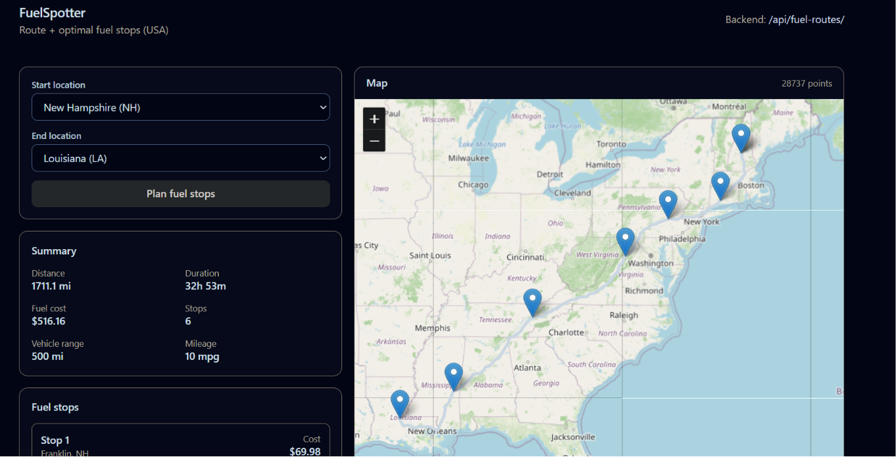

# FuelSpotter API (Django + DRF)

API that takes a start + end location within the USA, fetches a driving route (free OSRM), and returns an approximate fuel-stop plan optimized for cost using the provided `fuelPrices.csv` dataset.

## Quick Links

- Live Backend: https://fuelspotter.iamabhinav.dev/api/
- Live Frontend: https://fuelspotter.pages.dev/
- Postman collection (GitHub): https://github.com/rishiyaduwanshi/fuelspotter/blob/main/FuelSpotter%20API.postman_collection.json



> Note: The provided fuel price dataset does **not** include station latitude/longitude. This project therefore uses a **route sampling + reverse geocoding** approach to infer the region/state along the route, then picks cost-effective prices for those regions. This is an approximation and is documented under **Limitations**.

## Tech

- Django (latest stable used in this project)
- Django REST Framework (DRF)
- SQLite (default)
- Free routing: OSRM public server (`router.project-osrm.org`)
- Free geocoding/reverse-geocoding: Nominatim (OpenStreetMap)
- Caching: Django cache (used to reduce external calls)

## Project Structure

- `fuelspotter/` - Django project config
- `api/` - DRF app (views, urls, services)
- `api/services/` - service layer (routing, geocoding, fuel planning)
- `seeds/` - data import utilities
- `fuelPrices.csv` - input dataset
- `demo/` - endpoint notes + Postman collection

## Setup

### 1) Create & activate a virtualenv

PowerShell (Windows):

```powershell
python -m venv venv
Set-ExecutionPolicy -Scope Process -ExecutionPolicy RemoteSigned
./venv/Scripts/Activate.ps1
```

### 2) Install dependencies

```powershell
pip install -r requirements.txt
```

If `requirements.txt` is not present in your copy, install at least:

```powershell
pip install django djangorestframework requests
```

### 3) Migrate

```powershell
python manage.py migrate
```

### 4) Import fuel prices

Option A (management command):

```powershell
python manage.py import_fuel_prices
```

Option B (seed script):

```powershell
python seeds/fuelprices_seed.py
```

### 5) Run server

```powershell
python manage.py runserver
```

## Live URLs

- API (prod): https://fuelspotter.iamabhinav.dev/api/
- Client (prod): https://fuelspotter.pages.dev/

## Deployment notes (extra)

- Backend is hosted on a DigitalOcean VPS.
- Client is hosted on Cloudflare Pages.
- CI/CD via GitHub Actions.

## API

Base (local): `http://127.0.0.1:8000/api`

Base (prod): `https://fuelspotter.iamabhinav.dev/api`

### GET `/api/`
Lists available endpoints.

### GET `/api/health` (or `/api/health/`)
Health check.

### POST `/api/route` (or `/api/route/`)
Returns geocoded start/end plus OSRM route details.

Example body:

```json
{ "start": "Dallas, TX", "end": "Los Angeles, CA" }
```

### POST `/api/fuel-routes` (or `/api/fuel-routes/`)
Returns route summary + fuel stop plan + total fuel spend.

Example body:

```json
{
  "start_location": "Dallas, TX",
  "end_location": "Los Angeles, CA",
  "include_geometry": false
}
```

#### Response highlights

- `route.distance_miles`
- `route.estimated_duration_minutes`
- `route.bbox`
- `route.geometry`
  - By default, only `{ "type": "LineString" }` is returned (coordinates omitted to keep response fast).
  - Set `include_geometry: true` to include full LineString coordinates.
- `fuel_stops[]` - list of refuel stops
- `summary.total_fuel_cost` - total money spent on fuel

### JSON 404 behavior

Unknown `/api/*` routes return JSON (not Django HTML pages).

## Performance & External Calls

- OSRM route call is kept to **one request per start/end pair**, and cached.
- Nominatim calls are cached as well to avoid repeated reverse-geocoding.

## Assumptions

- Vehicle mileage: **10 mpg**
- Max range on full tank: **500 miles**
- Starting fuel: **0 miles** (empty tank)

## Limitations

- `fuelPrices.csv` has no station coordinates; true “stations within a corridor around the polyline” matching isn’t possible without enriching the dataset.
- Current approach: sample points on the route polyline → reverse geocode → infer state/city → select cost-effective prices for that region.

## Postman

- Postman collection (repo file): `FuelSpotter API.postman_collection.json`
- Postman collection (GitHub): https://github.com/rishiyaduwanshi/fuelspotter/blob/main/FuelSpotter%20API.postman_collection.json
